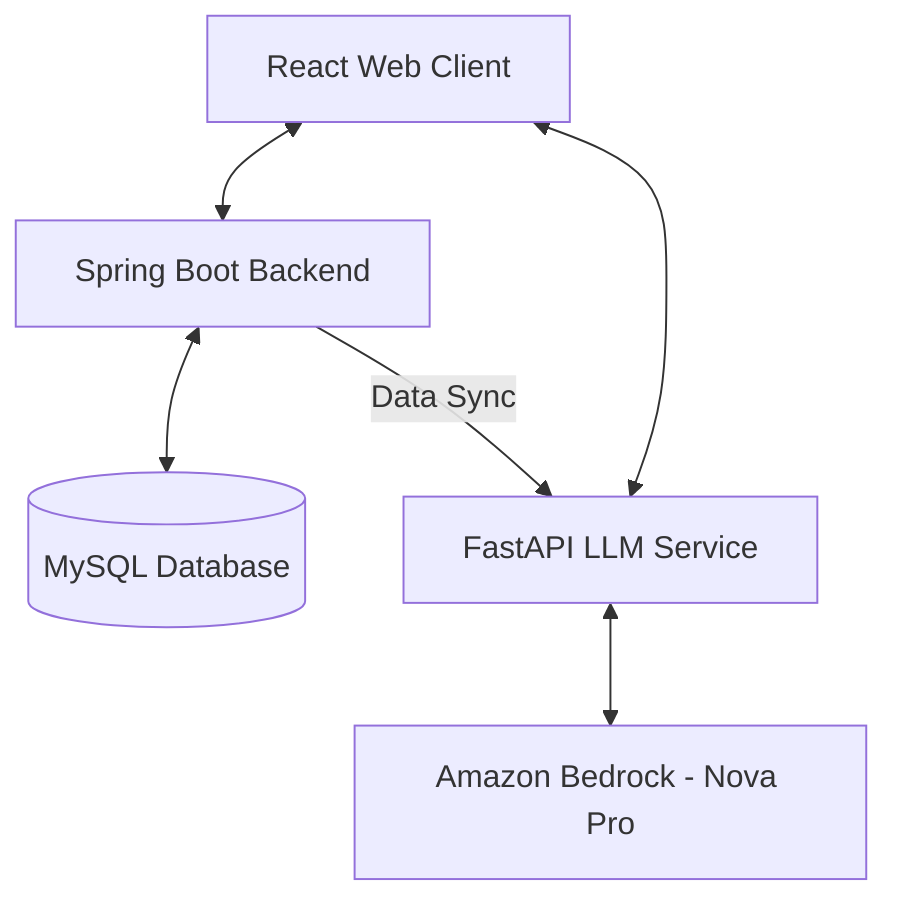

# Bank Visual Analytics: Branch Operations Dashboard

## 1. PROJECT OVERVIEW
### Summary
The **Bank Branch Operations Visual Analytics Dashboard** is a high-performance, enterprise-grade solution designed to monitor, analyze, and optimize bank branch activity. It transforms raw transactional and entry data into actionable insights through real-time visualizations and AI-driven predictions. By leveraging a sophisticated tech stack of Spring Boot, React, and Amazon Bedrock's Nova Pro LLM, the system provides a comprehensive view of branch footfall, service efficiency, and customer satisfaction.

### Real-world Problem Solved
Traditional banking operations often suffer from lack of visibility into "physical" traffic patterns. Managers struggle to:
- Predict peak hours accurately, leading to inefficient staffing.
- Identify service bottlenecks in real-time.
- Correlate customer footfall with actual revenue and transaction volume.
- Gain quick answers about complex branch metrics without manual data mining.

### Target Users
- **Branch Managers:** To optimize daily staffing and operations.
- **Operations Head:** To monitor performance across multiple regional branches (New York, Washington DC, New Jersey).
- **Data Analysts:** To export performance reports and identify historical trends.
- **Top Management:** For high-level revenue and efficiency monitoring.

### Why This Project Exists
This project was developed to bridge the gap between physical branch activity and digital analytics, providing a "Command Center" experience that uses Generative AI (LLM) to make data accessible through natural language queries.

### Project Goals
- **Real-time Visibility:** Centralize footfall and transaction data into a unified dashboard for instant operational insights.
- **AI-Driven Decision Making:** Empower managers with natural language querying capabilities via Amazon Bedrock for complex data analysis.
- **Operational Optimization:** Identify peak hours and service bottlenecks to improve staffing efficiency and reduce customer wait times.
- **Predictive Analytics:** Utilize historical data and moving-average algorithms to forecast future branch traffic and demand.
- **Enhanced Customer Experience:** Monitor service efficiency scores to ensure high-quality interactions across all bank services.

---

## 2. TECH STACK
### Backend
- **Java 21:** Core language for enterprise stability.
- **Spring Boot 3.1.5:** Framework for building the RESTful API and microservices.
- **Spring Data JPA:** For ORM and database interactions.
- **Maven:** Dependency and build management.

### Frontend
- **React 18.2:** UI library for building dynamic components.
- **Vite:** Next-generation frontend tooling for fast builds.
- **TailwindCSS:** Modern utility-first CSS framework for premium styling.
- **Recharts:** Composable charting library for high-quality data visualization.
- **Lucide-React:** For sleek, modern iconography.

### LLM & AI Service
- **Python 3.10+:** Language for the AI service layer.
- **FastAPI:** High-performance framework for the LLM integration layer.
- **Amazon Bedrock (Nova Pro):** The core "brain" providing AI-driven insights and natural language processing.
- **Boto3:** AWS SDK for Python to interact with Bedrock.

### Database
- **MySQL 8.0:** Relational database for storing branch, staff, and transaction data.

### Tools & Platforms
- **Git/GitHub:** Version control.
- **Swagger/OpenAPI:** Automatic API documentation.
- **Postman:** API testing.

---

## 3. SYSTEM ARCHITECTURE
### High-Level Architecture
The system follows a modern decoupled architecture:

### Interactions & Data Flow
1.  **Frontend (React) & Backend (Spring Boot):** The dashboard fetches metrics, branch lists, and transaction logs via REST APIs (port 8080).
2.  **Spring Boot & MySQL:** The backend processes business logic and stores data in a structured schema (branches, staff, entries, transactions).
3.  **Data Synchronization:** Spring Boot periodically sends a "Comprehensive Data Context" (cached snapshots of branch performance) to the **FastAPI LLM Service** (port 8000).
4.  **AI Query Flow:** When a user asks a question in the ChatBot, the React app hits the FastAPI endpoint. FastAPI uses the stored context + the user prompt to query **Amazon Bedrock Nova Pro**, receiving a precise, data-driven answer.
5.  **Branding Layer:** A `nameSwapper` utility in the frontend and a regex-based filter in Python ensure that Indian branch names are mapped to international equivalents (e.g., Siruseri -> New York) for a global presentation.

---

## 4. FOLDER & FILE STRUCTURE
### Root Structure
📁 **Bank-Footfall-Analysis/**
├── 📁 **backend/** – Spring Boot API Source
├── 📁 **frontend/** – React/Vite Dashboard Source
├── 📁 **LLM/** – Python FastAPI AI Service
├── 📁 **data/** – SQL Dumps and database migrations
├── 📁 **scripts/** – Node.js utilities for data generation
├── 📄 **start_backend.bat** – Quick launch script for backend
└── 📄 **LICENSE** – MIT License file

### Detailed Breakdown
#### 📁 backend/
- 📄 `pom.xml`: Defines Java 21 environment and AWS/Spring dependencies.
- 📁 `src/main/java/com/Bank/analytics/`:
  - 📁 `controller/`: REST endpoints for Branches, Analytics, and Dashboard.
  - 📁 `entity/`: JPA entities representing DB schema (Branch, Staff, Transaction).
  - 📁 `service/`: Core logic; includes `AnalyticsService` for metric calculations and `BedrockNovaProService` for context building.
  - 📁 `repository/`: Spring Data repositories for MySQL access.
  - 📁 `dto/`: Data Transfer Objects for optimized API responses.
- 📁 `src/main/resources/`: `application.yml` for DB secrets and port config.

#### 📁 frontend/
- 📄 `package.json`: React dependencies (recharts, lucide, tailwind).
- 📁 `src/`:
  - 📁 `components/`:
    - 📁 `Dashboard/`: `BranchDashboard`, `FootfallChart`, `PeakHourAnalysis`, `ServiceHeatmap`.
    - 📁 `Reports/`: UI for PDF/Excel generation.
    - 📁 `Admin/`: User and staff management interfaces.
    - 📄 `ChatBot.jsx`: The primary AI interaction portal.
  - 📁 `pages/`: High-level page components (Dashboard, Login, Reports).
  - 📁 `hooks/`: `useDashboardData` for real-time state management.
  - 📁 `services/` & `utils/`: `api.js` for Axios calls and `nameSwapper.js` for branding.

#### 📁 LLM/
- 📄 `enhanced_bedrock_fastapi.py`: The heart of the AI service. Handles prompt engineering, Bedrock API calls, and context management.
- 📄 `requirements.txt`: Python dependencies (fastapi, boto3, uvicorn).
- 📁 `util/`: Helper scripts for specific Bedrock models (Nova, Bedrock).

#### 📁 scripts/
- 📄 `generate-fake-data.js`: A massive automation script using `faker.js` to populate the database with 2 years of realistic banking history.

---

## 5. CORE FEATURES
### 1. Real-time Analytics Dashboard
- **What it does:** Displays live footfall, wait times, and revenue metrics.
- **Logic:** Aggregates database entries using 30-second polling.
- **Key Files:** `Dashboard.jsx`, `BranchDashboard.jsx`, `AnalyticsService.java`.

### 2. AI-Powered Assistant (Nova Pro)
- **What it does:** Answers questions like "Which branch had the highest footfall in the last 3 months?" or "Recommend staffing for DC branch on Mondays."
- **How it works:** Uses a RAG-like (Retrieval-Augmented Generation) approach by feeding a summarized snapshot of the database into the LLM prompt.
- **Key Files:** `ChatBot.jsx`, `enhanced_bedrock_fastapi.py`, `BedrockNovaProService.java`.

### 3. Service Heatmap & Peak Hour Analysis
- **What it does:** Visualizes demand across different services (Cash, Loans, Forex) and hours of the day.
- **Logic:** Heatmap grid calculated by cross-referencing transaction timestamps with service categories.
- **Key Files:** `ServiceHeatmap.jsx`, `PeakHourAnalysis.jsx`.

### 4. Enterprise Reporting
- **What it does:** Generates automated summaries and schedules exports.
- **Key Files:** `Reports.jsx`, `ReportGenerator.jsx`.

---

## 6. BUSINESS LOGIC EXPLANATION
- **Footfall Prediction:** Uses a moving-average algorithm combined with a "Day of Week Multiplier" (e.g., Mondays are +20%, Weekends are -40%) to forecast next week's traffic.
- **Service Efficiency Score:** Calculated as: `(Transaction Count * Target Time) / (Actual Processing Time + Wait Time)`. A score > 80% is considered "Optimal".
- **Branding Logic:** The system strictly converts Indian-style naming conventions to International standards in the UI layer to maintain a premium profile.
- **Assumptions:** Data assumes an 8-hour working window (9 AM - 5 PM) with a peak during lunch hours (12 PM - 2 PM).

---

## 7. SETUP & INSTALLATION
### Prerequisites
- **Java:** JDK 21
- **Node.js:** v18 or later
- **Python:** 3.10+
- **MySQL:** 8.0
- **AWS Account:** With Amazon Bedrock "Nova Pro" model access enabled.

### 1. Database Setup
1. Create a database named `Bank_branch_analytics`.
2. Import the SQL dump: `mysql -u root -p Bank_branch_analytics < data/Dump20251106.sql`.

### 2. Backend Setup
1. Navigate to `/backend`.
2. Configure `src/main/resources/application.properties` with your MySQL credentials.
3. Run: `./mvnw clean install` and `./mvnw spring-boot:run`.

### 3. LLM Service Setup
1. Navigate to `/LLM`.
2. Install dependencies: `pip install -r requirements.txt`.
3. Set your AWS credentials (AWS_ACCESS_KEY_ID, AWS_SECRET_ACCESS_KEY).
4. Run: `python enhanced_bedrock_fastapi.py`.

### 4. Frontend Setup
1. Navigate to `/frontend`.
2. Install dependencies: `npm install`.
3. Run: `npm run dev`.

---

## 8. HOW TO RUN
### Launch Procedure
1. **Start MySQL Server.**
2. **Launch Backend (API):** Execute `start_backend.bat` or run manually via Maven.
3. **Launch AI Service:** `python LLM/enhanced_bedrock_fastapi.py`.
4. **Launch Portal:** `npm run dev` in the frontend folder.
5. **Access:** Open `http://localhost:5173`.

---

## 9. SAMPLE INPUTS & OUTPUTS
### ChatBot Question
**Input:** "Compare footfall in New York vs New Jersey for June 2025."
**Output:** "📊 New York recorded 4,250 visitors (+12% MoM) while New Jersey saw 3,800. New York is operating near peak capacity during mornings."

---

## 10. ERROR HANDLING
- **Backend Error 500:** Occurs if the database is disconnected. Check `application.properties`.
- **LLM Timeout:** If Bedrock takes > 10s, the system falls back to a locally computed summary (`generateFallbackResponse` in JavaScript).
- **CORS Issues:** The `CorsConfig.java` is pre-configured for `localhost:5173`. If running on a different port, update the whitelist.

---

## 11. SECURITY CONSIDERATIONS
- **JWT Authentication:** Secure login for Admin/Manager roles. Role-based access control (RBAC) ensures analysts cannot delete branch data.
- **Secret Management:** Sensitive AWS keys and DB passwords are moved to `.env` files (excluded via `.gitignore`).
- **Data Sanitization:** SQL injection prevention through Spring Data JPA's parameterized queries.

---

## 12. FUTURE IMPROVEMENTS
1. **Predictive Staffing Engine:** Automatic roster generation based on predicted AI footfall.
2. **Face Recognition Integration:** To identify "High Net-Worth Individual" (HNI) entries instantly.
3. **Multi-Currency Support:** For International branch revenue tracking.

---

## 13. PROJECT TIMELINE (June–July 2025)
- **Phase 1: Planning (June 1-7):** Requirement gathering, DB schema design, and selection of Amazon Bedrock as the AI engine.
- **Phase 2: Backend Development (June 8-25):** Core entities, MySQL integration, and Analytics logic for footfall calculation.
- **Phase 3: Frontend Construction (June 26 - July 10):** Designing the "Premium" dashboard layout, integrating Recharts, and building the nameSwapper branding layer.
- **Phase 4: LLM Integration (July 11-20):** Building the FastAPI bridge and fine-tuning prompts for Nova Pro.
- **Phase 5: Testing & Optimization (July 21-30):** Bug fixing, data generation, and UI polishing.

---

## 14. LICENSE & CREDITS
### License
This project is licensed under the **MIT License**.

### Credits
- **Developer:** K Sai Charan & The Analytics Development Team
- **Inspiration:** Modern banking ERP systems and AWS AI showcases.
- **Tech Support:** Amazon Bedrock Documentation.

---
**© 2025-2026 ABC Bank Analytics Project**
